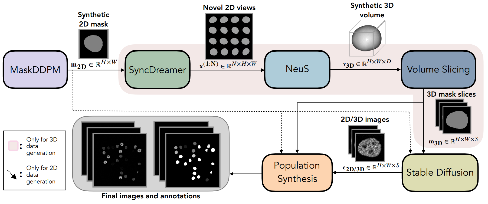

<div align="center">

# The library for Cascaded Diffusion Models for 2D and 3D Microscopy Image Synthesis to Enhance Cell Segmentation [ISBI 2025 Oral]
[](https://arxiv.org/pdf/2411.11515)
</div>


## 👋 Introduction

This repository contains the source code for Cascaded Diffusion Models for 2D and 3D Microscopy Image Synthesis to Enhance Cell Segmentation, capable of generating realistic-looking synthetic cell microscopy images.

<p align="center">
  
</p>

## ⬇️ Installation

You can set up a conda environment as follows:

```bash
# We reccomend using a virtual environment
conda create -n cascaded python=3.8.5
conda activate cascaded

# Clone the repository and install in editable mode
git clone https://github.com/ruveydayilmaz0/cascaded_diffusion.git
cd cascaded_diffusion
pip install -r requirements.txt
```

## 📚 Data Preparation
The model trains on [2D](https://celltrackingchallenge.net/2d-datasets/) and [3D](https://celltrackingchallenge.net/3d-datasets/) Microscopy data from the Cell Tracking Challenge. Before training, the training set should be downloaded and individual cell images should be extracted using utils/extract_single_cells_2D.py or utils/extract_single_cells_3D.py

```bash
python utils/extract_single_cells.py \
--data_root PATH_TO_THE_TRAINING_DATA \
--cell_group CELL_GROUP_TO_BE_EXTRACTED_FROM_THE_DATASET (01 OR 02) \
--new_data_folder SAVE_PATH_FOR_THE_EXTRACTED_IMAGES \
--new_mask_folder SAVE_PATH_FOR_THE_EXTRACTED_MASKS \
```

## 💪 Training
For generating synthetic masks, we first train a 2D unconditional DDIM. For training, follow the instructions in [DDIM](https://github.com/huggingface/diffusers.git).

For the 3D datasets, the resulting 2D synthetic masks should be converted to 3D using [SyncDreamer+NeuS](https://github.com/liuyuan-pal/SyncDreamer.git). The generated volumes should be sliced in z running:
```bash
python utils/slice_mesh_to_2d.py \
--root_volumes PATH_TO_GENERATED_VOLUMES \
--output_size DESIRED_OUTPUT_SLICE_SIZE
```

Finally, download the [pretrained Stable Diffusion](https://huggingface.co/stable-diffusion-v1-5/stable-diffusion-v1-5) and finetune it using real image-mask pairs by running:
```bash
python train/train_cells.py \
--dataset_root PATH_TO_THE_DATASET
```

## 👁️‍🗨️ Inference

Inference involves the generation of synthetic masks and cell textures conditioned on the masks as follows:

```bash
python inference/generate_masks.py \
--output_path SAVE_PATH_FOR_THE_OUTPUTS \
--pretrained_model PRETRAINED_MODEL_PATH \
--num_masks NUM_MASKS_TO_GENERATE \
--diff_steps DIFFUSION_TIMESTEPS 
```

```bash
python inference/generate_cells.py \
--out_path SAVE_PATH_FOR_THE_OUTPUTS \
--pretrained_model PRETRAINED_MODEL_PATH \
--masks PREGENERATED_MASKS_PATH \
--ddim_steps DIFFUSION_TIMESTEPS 
```

## 📊 Evaluation

To assess the quality of the generated synthetic images, we use four different metrics:
1. [SEG:](http://celltrackingchallenge.net/evaluation-methodology/) We train [a segmentation algorithm](https://github.com/MouseLand/cellpose/tree/main) on the synthetic images and test its performance on real data.
2. [FID](https://pytorch.org/ignite/generated/ignite.metrics.FID.html) on images

## 🗒️Citation

```tex
@article{yilmaz2024cascaded,
  title={Cascaded Diffusion Models for 2D and 3D Microscopy Image Synthesis to Enhance Cell Segmentation},
  author={Yilmaz, R{\"u}veyda and Keven, Kaan and Wu, Yuli and Stegmaier, Johannes},
  journal={arXiv e-prints},
  pages={arXiv--2411},
  year={2024}
}
```
